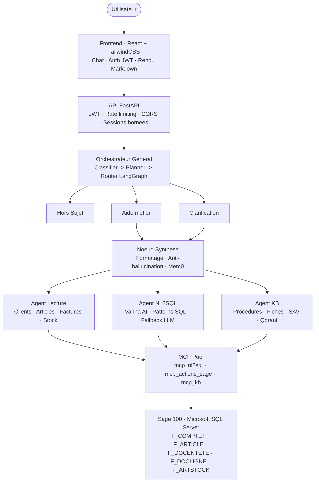

# Agent Sage - Copilot ERP Sage 100

> Assistant conversationnel intelligent pour l'ERP **Sage 100**, pilote par une architecture multi-agents avec **LangGraph**, des LLM locaux via **Ollama**, et des serveurs **MCP** dedies.

---

## Presentation

**Agent Sage** est un copilote IA concu pour interagir nativement avec la base de donnees Sage 100 en langage naturel. Il permet a un utilisateur (commercial, gestionnaire, comptable) de :

- **Interroger** les donnees ERP sans connaitre SQL
- **Creer et transformer** des documents commerciaux (BL, Factures, Avoirs...)
- **Analyser** les performances (CA, stock, DSO, RFM...)
- **Exporter** des rapports Excel et des PDF generes automatiquement
- **Apprendre** continuellement grace a une boucle de classification semi-supervisee

---

## Architecture



---

## Intelligence artificielle

### Classificateur hybride

Le coeur du systeme utilise une classification a trois couches :

| Couche | Methode | Latence |
|--------|---------|---------|
| Regles | Patterns regex metier | ~0 ms |
| Semantique | Similarite cosinus sur embeddings (centroides) | ~10 ms |
| LLM | Fallback Ollama / Groq si ambiguite | ~500 ms |

La boucle d'apprentissage (`apprentissage/`) collecte les interactions, propose des exemples candidats, et attend une **validation humaine** avant toute mise a jour du dataset.

### NL2SQL

- **Vanna AI** : generation SQL par similarite semantique sur ChromaDB
- **Patterns pre-definis** : requetes optimisees pour les cas courants Sage 100
- **Fallback LLM** : generation SQL guidee si Vanna echoue

### Extraction d'entites

- **GLiNER** *(optionnel)* : NER multi-langues
- **Regex** : codes clients / articles
- **LLM** : extraction structuree en dernier recours

---

## Fonctionnalites

### Lecture et Analyse

- Liste clients / articles / fournisseurs
- Top clients par CA — Saisonnalite — RFM
- Palmares articles les plus vendus
- Factures impayees (client / fournisseur)
- DSO (delai moyen de paiement)
- Stocks disponibles par article
- Clients en baisse de CA

### Ecriture et Workflow

- Creation client / fournisseur avec controle d'encours
- Generation BL / Facture / BC / OF / BF
- Transformation de document (OF->BF, BL->Facture)
- Creation avoir (toutes lignes, montants negatifs)
- Reglement facture (controle anti-doublon)
- Mouvement de stock atomique (refus si stock < 0)
- Numeros de piece uniques (horodatage + UUID)

### Export

- PDF generes (reportlab + PyMuPDF)
- Offre de prix Excel
- Declaration fiscale mensuelle
- Balance agee
- Dashboard KPI

### Base de connaissances

- Procedures internes (Markdown / PDF)
- Fiches techniques articles
- Reclamations SAV
- Recherche hybride BM25 + vectorielle (Qdrant)

---

## Structure du projet

```
agent_sage/
├── api/
│   ├── __init__.py               # App FastAPI, routes, sessions
│   ├── auth.py                   # Authentification JWT
│   ├── orchestrateur_general.py  # Orchestrateur LangGraph (coeur)
│   ├── mcp_pool.py               # Pool de connexions MCP
│   ├── mcp_actions_sage.py       # Serveur MCP - actions ERP
│   ├── mcp_nl2sql.py             # Serveur MCP - NL2SQL
│   ├── mcp_knowledge_base.py     # Serveur MCP - base de connaissances
│   ├── mcp_server_sage.py        # Entree MCP serveur
│   ├── llm_anonymizer.py         # Anonymisation donnees sensibles
│   ├── vanna_training_neutral.py # Entrainement Vanna AI
│   └── graph_nodes/              # Noeuds LangGraph
│
├── classification/
│   ├── semantic_classifier.py    # Embeddings + centroides
│   ├── semantic_examples.yaml    # Dataset de classification (1500+ exemples)
│   ├── classification_engine.py  # Moteur de regles
│   ├── calibrate_thresholds.py   # Calibration des seuils
│   └── valider_classification.py # Validation des performances
│
├── apprentissage/                # Boucle d'apprentissage semi-supervise
│
├── database/
│   ├── schema_sage.py            # Source de verite : codes/prefixes Sage
│   └── init_db_complet.py        # Initialisation MSSQL
│
├── extraction/                   # Extraction d'entites (NER)
├── formatting/                   # Formatage des reponses
├── kb/                           # Base de connaissances (Markdown / PDF)
├── models/                       # Modeles Pydantic partages
├── session/                      # Gestion d'etat conversationnel
│
├── frontend/
│   ├── src/
│   │   ├── App.tsx               # Application principale (chat)
│   │   └── Login.tsx             # Page de connexion
│   ├── vite.config.ts
│   └── package.json
│
├── tests/
│   └── test_document_workflows.py
│
├── config/
│   └── requirements.txt
├── documents_generes/
├── declarations_generes/
└── .env
```

---

## Installation

### Prerequis

- Python 3.10+
- Node.js 18+
- [Ollama](https://ollama.com/download) installe et en cours d'execution

```bash
ollama pull llama3.1:8b
ollama pull qwen2.5:14b
```

### 1. Cloner le depot

```bash
git clone https://github.com/<votre-organisation>/agent_sage.git
cd agent_sage
```

### 2. Backend Python

```bash
python -m venv .venv
.venv\Scripts\activate

pip install -r config/requirements.txt
```

### 3. Frontend React

```bash
cd frontend
npm install
```

### 4. Configuration

Copier `.env.example` vers `.env` et adapter :

```env
OLLAMA_BASE_URL=http://localhost:11434
GROQ_FAST=llama3.1:8b
GROQ_SMART=qwen2.5:14b

LLM_FALLBACK_KEY=gsk_...
LLM_FALLBACK_URL=https://api.groq.com/openai/v1
LLM_FALLBACK_MODEL=llama-3.1-70b-versatile

DB_CONNECTION_STRING=mssql+pyodbc://...

ENABLE_VANNA=true
ENABLE_GLINER=false
ENABLE_MEM0=false
ENABLE_SEMANTIC_CLASSIFIER=true

SECRET_KEY=your-very-secret-jwt-key
RATE_LIMIT=100
```

### 5. Initialiser la base de donnees

```bash
python database/init_db_complet.py
```

### 6. Lancer l'application

```bash
# Terminal 1 - Backend
uvicorn api:app --host 0.0.0.0 --port 8000 --reload

# Terminal 2 - Frontend
cd frontend
npm run dev
```

L'interface est accessible sur `http://localhost:5173`.

---

## Securite

| Mesure | Description |
|--------|-------------|
| JWT | Toutes les routes API requierent un token valide |
| Rate limiting | 100 req/min par defaut (configurable via `RATE_LIMIT`) |
| Anonymisation LLM | Donnees sensibles masquees avant envoi aux LLM cloud |
| Validation SQL | Toutes les requetes validees via `sqlglot` avant execution |
| PDF proteges | Telechargement PDF via endpoint authentifie uniquement |
| Sessions bornees | TTL + plafond max de sessions simultanees |
| Anti-doublon | Verification idempotente sur transformations, avoirs, reglements |

---

## Performance

- Cache disque : TTL 10 min pour les reponses LLM couteuses
- Cache memoire : articles, noms clients (invalidation automatique)
- Warmup Ollama : prechargement des modeles au demarrage de l'API
- Semaphore LLM : max 2 appels LLM simultanees
- Timeouts adaptatifs : 120 s (fast) / 300 s (smart)
- Embeddings pre-calcules : centroides charges en memoire au demarrage

---

## Tests

```bash
pytest tests/ -v
pytest tests/test_document_workflows.py -v
```

Les tests couvrent :

- Insertion de documents multi-lignes
- Generation de numeros de piece uniques
- Controle de stock avant creation de facture
- Protection contre les ecritures dupliquees

---

## Debug (mode CLI)

```bash
python -m api.orchestrateur_general

# Commandes disponibles dans le chat :
# session        -> etat de la session
# cache          -> statistiques du cache
# warmup         -> precharger les modeles
# reset          -> reinitialiser la session
# vanna_retrain  -> reentrainer Vanna AI
```

---

## Boucle d'apprentissage

Le systeme s'ameliore en continu sans intervention automatique sur le modele :

```
Interactions utilisateur
        |
        v
interaction_logger.py  -->  logs_classification.jsonl
        |
        v
extraire_cas_logs.py   -->  jeux de donnees candidats
        |
        v
valider_classification.py  -->  metriques de performance
        |
        v
apprentissage_semi_auto.py  -->  exemples proposes (validation humaine requise)
        |
        v
run_learning_cycle.py  -->  enrichissement du dataset valide
```

> **Aucune modification du classifieur n'est effectuee sans validation humaine.**

---

## Stack technique

| Couche | Technologies |
|--------|-------------|
| Backend | Python 3.10+, FastAPI, LangGraph, Pydantic |
| LLM | Ollama (local), Groq (cloud fallback), langchain-ollama |
| NL2SQL | Vanna AI, ChromaDB, sqlglot |
| Recherche vectorielle | Qdrant, sentence-transformers |
| Memoire | Mem0 (optionnel), sessions FastAPI |
| NER | GLiNER (optionnel), regex |
| Generation de docs | reportlab, PyMuPDF, openpyxl |
| Frontend | React 18, TypeScript, Vite, TailwindCSS 4 |
| Auth | PyJWT, hashlib |
| Base de donnees | Microsoft SQL Server (MSSQL) |

---

## Licence

Proprietaire - Tous droits reserves.

---

## Contributeurs

- Equipe ERP Sage 100

---

**Version** : 9.4 · **Derniere mise a jour** : Aout 2026